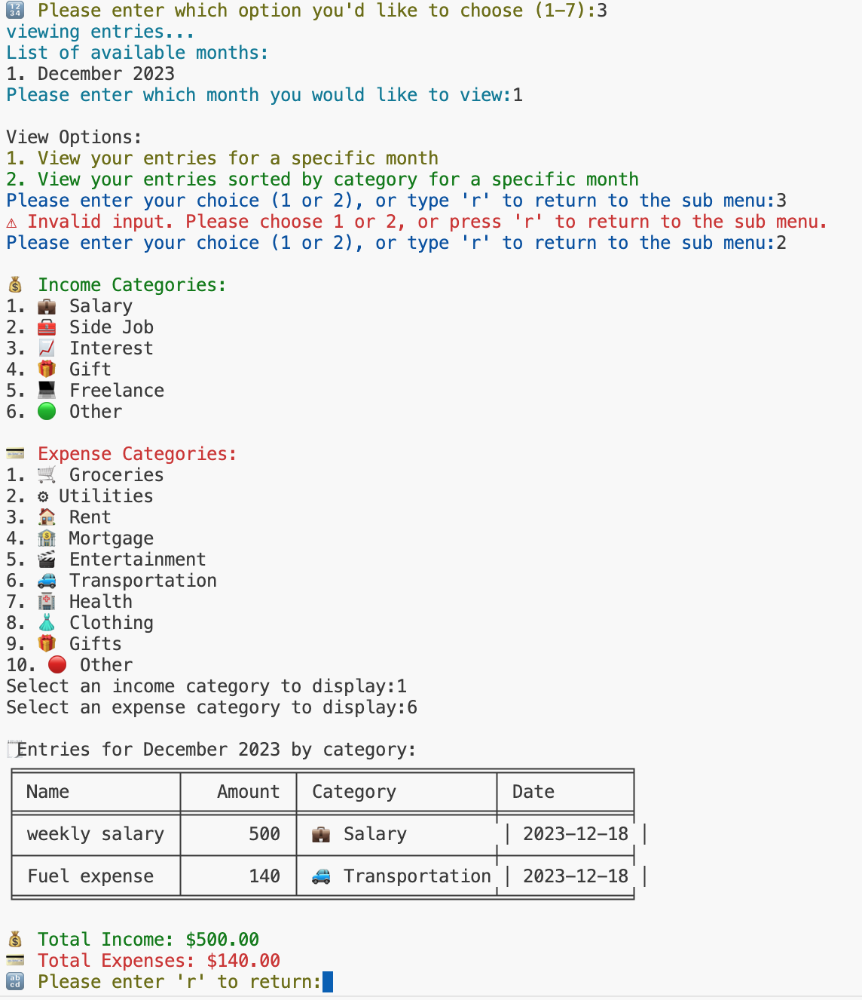

# T1A3 - Terminal Application: Expense Tracker

# Links

**Source Control Repository** - https://github.com/IshanAcharya/T1A3TerminalApplication 

**Project Management Board (Trello)** - https://trello.com/b/BTKtqG1W

**Presentation Video** - https://youtu.be/QHGodmcDBCE

# Budget Buddy - Expense Tracker Terminal Application


**Budget Buddy** is a terminal expense tracking tool created in the Python language, and exists to help users manage their finances! The application assists users to record detailed income and expense entries, track their spending habits, and allow them to further analyse the financial data with external data analysis tools. Budget Buddy also allows users to save, load, and export data for record-keeping purposes, making it an easy free solution to help users stay on top of their budget!

**DISCLAIMER**: This expense tracker application was developed for my T1A3 Terminal Application project for my Coder Academy Web Development Bootcamp, and was created for educational purposes in showcasing my coding and software development skills in Python. This application is not intended for precise real-world financial use, and users are advised to not rely on its accuracy, or lack thereof, for any legal financial reporting obligations. By using this app, you acknowledge that I hold no liability for any financial loss that may be incurred through the application. 

Additionally, please note that there are no data protection or privacy measures implemented in this application as it falls outside the scope of this project. Furthermore, I lack the expertise to implement those measures and as such you, the user, are responsible in implementing adequate data protection measures to safeguard your financial information. I assume no liability for any mismanagement or unauthorised access to your Expense Tracker data.

# Help Documentation

## How to Download, Install and Run the application

To download, install and run Budget Buddy, you can follow either of the steps below. 

Before doing this, please note that this application requires Python 3 to be installed on your machine. To check whether Python is installed on your machine, open Terminal and enter the following command:
```python3 --version```

If Python is installed, it should display the Python version number that is installed on your machine. If it does not, it means that Python is not installed on your machine. You can download and install Python from the [Official Python website](https://www.python.org/downloads/).

Alternatively, if you have Python 2 installed, please download and install any version of Python 3 from the Official Python website.

**Clone Repository**

1. Clone the source repository from the [T1A3TerminalApplication GitHub Repository](https://github.com/IshanAcharya/T1A3TerminalApplication)
2. Launch terminal on your device, and enter the following command:
```git clone https://github.com/IshanAcharya/T1A3TerminalApplication.git```
3. Navigate to the project directory by entering the following command:
```cd T1A3TerminalApplication/src```
4. Make the bash script executable by running the following command:
```chmod +x run_expense_tracker.sh```
5. Run the application by entering the following command to execute the script and install the dependencies:
```./run_expense_tracker.sh```

**Download Zip File**

1. Download the zip file containing the source repository from the [T1A3TerminalApplication GitHub Repository](https://github.com/IshanAcharya/T1A3TerminalApplication)
2. Navigate to the downloaded zip file and unzip the folder to your desktop
3. Launch terminal on your device, and navigate to the project directory by entering the following command:
```cd T1A3TerminalApplication/src```
4. Make the bash script executable by running the following command:
```chmod +x run_expense_tracker.sh```
5. Run the application by entering the following command to execute the script and install the dependencies:
```./run_expense_tracker.sh```

After you have the application running, please navigate to the 'view instructions' option in the main menu of the application to view instructions on how to use Budget Buddy.

## Application Dependencies

* This application utilises Python packages to run the application. This includes a mix of built-in and external packages. These packages include:

    * Emoji
    * Tabulate
    * Colorama
    * Datetime
    * csv
    * os

These packages will be installed automatically when you run the script in the installation steps outlined above in the Help Documentation. 

## System & Hardware Requirements

* This application is designed to run on multiple operating systems, such as:
    * Windows
    * macOS
    * Linux

Please ensure that Python 3.x is installed on your system in order to run this application.

* There are no hardware requirements to run this application as it does not require much processing or computing power. Any modern computer or laptop that has a terminal should be able to run this application.

# List of Main Features

## Feature 1 - Record Income and Expenses


The expense tracker application includes a feature to allow users to record income and expenses to allow them to do some simple budgeting by keeping track of their money coming inbound and going outbound. Users can input income and expense entries with details including income/expense names, income/expense amounts, income/expense categories, and income/expense dates. 

The application stores these information for income and expense entries within variables such as ```income_name```, ```income_amount```, ```income_category```, ```expense_name```, ```expense_amount```, and ```expense_category```. Dates for both income and expense entries are applied by the datetime module, which records the income/expense entry dates at the current date that it was recorded. All of these variables are stored within the ```record_income``` and ```record_expense``` functions.

When users are prompted to enter income or expense names, a ```while True``` loop in the code checks whether the input name contains only alphabetic characters or not. If the condition is not met, an error message is displayed to inform the user of the invalid input, and help guide the user to enter a valid name.

## Feature 2 - View Income and Expenses (by month and by category)




The expense tracker application includes a feature to allow users to view their recorded income and expense entries, which assists them to gain insights into their financial and spending habits. Users can analyse their data by month, and by category, which will help give them an overview of their income and spending patterns. 

The application goes through the income and expense entries and filters them based on the user's preference of by month or by category, and stores them within the variables ```selected_month```, ```selected_month_index```, ```selected_income_category```, ```selected_expense category```, and ```unique_month```, which are all found within the ```view_entries``` function.

The code within this feature utilises ```for``` loops to go through all entries and display entries that the user has selected based on their preferred filters (by month or by category). ```if``` statements are utilised to check conditions, such as valid user input, to filter the entries accordingly. To ensure valid input, ```while True``` loops are utilised to check whether the user has selected months that don't have any entries, or categories that don't exist, and an error message is displayed to inform the user of the invalid input and help guide the user to enter valid input.
 
## Feature 3 - Save, Load and Export Data


The expense tracker application includes features for users to save their data to a file, load the saved expense tracker from file to restore the data in the application, and export the data to a csv file. These features, all of which share similarities in how they function, allows users to efficiently manager their financial records. It provides users with the means to keep their income and expense entries for future reference when using the application again, provide historical reference to their previous data, and keep a backup of their data for external financial use.

The application interacts with the file system to save, load, and export data by utilising variables to facilitate these actions. For saving expense tracker data, the application uses variables such as ```desktop_data``` and ```file_name``` to store the path to the user's desktop on their local machine, and store the data within it. For loading expense tracker data, the application utilises variables such as ```loaded_data``` and ```file_name``` to identify files to load, and retrieve the stored information from the file. When exporting data, the application processes the export by utilising variables including ```file_name``` and ```export_data``` to identify the destination file, and the accompanying data that is to be exported.

The code within this feature utilises ```while True``` loops to prompt users to provide their input when specifying file names to save, load or export data, and prompts the user repeatedly until the user provides a valid input. The code also utilises ```if``` statements to check for certain conditions, such as whether data files already exist to export the file or not. If the conditions are met, error messages are displayed to inform the user of the file already existing. 

# Application Testing

Two (2) manual tests were designed to test two of the main features of the application to check that the application was running as expected. The outline and summary of these tests can be found within the ```ExpenseTrackerTests.pdf``` file in the docs folder.

1. **Feature 1: Record Income and Expenses**

    

    1. Test Case #1: To test that the record_income function is working as intended by adding an income entry with income name 'weekly salary', income amount of '$5,000', and income category 'Salary', with the datetime package adding today's current date (16 December 2023). This entry should be displayed in a table format with the tabulate package.

    2. Test Case #2: To test that the record_expense function is working as intended by adding an expense entry with expense name 'weekly rent', expense amount of '$800', and expense category 'Rent', with the datetime package adding today's current date (16 December 2023). This entry should be displayed in a table format with the tabulate package.

2. **Feature 3: Save, Load and Export Data**

    

    1. Test Case #1: To test that the save_data_to_file function is working as intended by saving expense tracker file from test #1, with the income and expense data present, by inputting the file name 'my_data', and saving it to the user's desktop location on their local machine. The saved data file should contain the recorded income and expense data from test #1 on it.

    2. Test Case #2: To test that the load_expense_tracker function is working as intended by loading the saved data file from test #2, containing the data from test case #1, by inputting the file name 'my_data' from the user's desktop. Once the file has been loaded, it should restore the income and expense data from test #1 in the view_budget function.

    

# Application Ideation Process

I gained the idea to create an expense tracker application amidst the current cost of living crisis in the world, particularly in Australia. I envisioned creating a tool that anyone could use to keep an eye on their spending habits. 

Once I had my idea, I wanted to outline the key features and functionalities that users would want from the application. To help me identify these, I created user stories that would help me identify the key components I wanted to include in the application.

Please Note: The User Stories can be found within the ```UserStories.md``` file in the docs folder.

The next step was to flesh out how these features would work and explore the logic behind the features and the application as a whole. I created pseudocode to create a draft of how I wanted the key components of the application to work, and what was required to get it working. I initially laid out the functions that I would need to operate my key features, before expanding on what each function would require to work.

Please Note: The Pseudocode can be found within the ```Pseudocode.md``` file in the docs folder.

After identifying the key features I wanted to implement, and the logic of how these features would work with each other to deliver a working application, I outlined the structure and flow of the application by connecting the dots between the two aspects and creating a flowchart for how the application would work from start to finish.


# Implementation Plan


The ideation stage of my application gave me a rough idea of how I was going to implement my application, and I created an implementation plan to help guide me in turning my idea into an operational end product. 

I utilised Trello to create a project board to structure out my implementation plan to help me get started in developing my expense tracker application. I utilised Trello on a near daily basis to keep track of the progress I was making, keep sight of what tasks I had to do in front of me, and remind me of my deadlines.  

Different sections of the development process of the application, and the T1A3 Terminal Application project, were broken down into different activities for me to deliver. This helped me break up the tasks and not make the development feel laborious, whilst also allowing me to stay on track of delivering the project on time.

I created different labels to prioritise different tasks and components on a degree of difficulty from easy to hard, and utilised the deadline feature (with free trial of Trello Pro) to assign deadline dates for each activities.


## Project Milestones


I separated the deliverables of my T1A3 Terminal Application project to 5 different activities to help separate my tasks, and provide a clear timeline as to when I needed to complete each section of the project. I separated these activities based on their categories (and labelled as such) including 'setup & coding', 'coding', 'documentation', 'slide deck & presentation' and 'final submission'. 

These activities included:

**Activity 1 - Project Scoping & Setup**


**Activity 2 - Application Coding & Testing**


**Activity 3 - Documentation**


**Activity 4 - Slide Deck & Presentation**


**Activity 5 - Submission of T1A3 Terminal Application**


## Milestone Deadlines


I allocated all of my project milestone deadlines in this list, so that I could take a look at when each of my activity deliverables were due. This allowed me to plan out my activities and move my project hours around so that I could dedicate myself in finishing my tasks for each activity to keep up with my timeline. I utilised labels, the same ones from the Project Milestones list, to serve as an indicator of which components of my project were still outstanding (e.g. Setup and scoping, coding, documentation, slide deck & presentation, or final submission).

## Implementation of Feature 1: Record Income and Expenses


I allocated the implementation of the record income and expenses feature within this list and utilised it to create a checklist of the tasks I needed to do to create this feature.

This included:

* Creating classes for income and expense
* Implementing a function to record income entries
* Implementing a function to record expense entries
* Implement error handling for potential issues during entry input
* Implement data validation to validate the recorded data

Each of these checklist items had sub-items within them to help me narrow in on certain components of implementing the core feature.

I assigned labels to each of these tasks based on a degree of difficulty from easy to hard to assist on prioritising my tasks, and assigned deadlines to each of those tasks to ensure that I was making regular progress with the development of my application. I also assigned labels marks as critical for features that I needed to do urgently to ensure that the core essential features of the application worked.

## Implementation of Feature 2: View Income and Expenses (by month and by category)


I allocated the implementation of the view income and expenses (by month and by category) feature within this list and utilised it to create a checklist of the tasks I needed to do to create this feature.

This included:

* Implementing a function to view inome and expenses by month
* Implementing a function to view income and expenses by category
* Integrate tabulate package to create appealing display of data
* Implement error handling for possible issues regarding user input when viewing by month and category
* Implement data validation to ensure consistency in displayed data

Each of these checklist items had sub-items within them to help me narrow in on certain components of implementing the core feature.

I assigned labels to each of these tasks based on a degree of difficulty from easy to hard to assist on prioritising my tasks, and assigned deadlines to each of those tasks to ensure that I was making regular progress with the development of my application. I also assigned labels marks as critical for features that I needed to do urgently to ensure that the core essential features of the application worked.

## Implementation of Feature 3: Save, Load and Export Data


I allocated the implementation of the save, load and export data feature within this list and utilised it to create a checklist of the tasks I needed to do to create this feature.

This included:

* Implementing function to save data
* Implementing function to load data
* Implementing function to export data
* Implementing data validation to validate saving/loading/exporting of data
* Implement error handling for potential issues during file saving, loading and exporting data

Each of these checklist items had sub-items within them to help me narrow in on certain components of implementing the core feature.

I assigned labels to each of these tasks based on a degree of difficulty from easy to hard to assist on prioritising my tasks, and assigned deadlines to each of those tasks to ensure that I was making regular progress with the development of my application. I also assigned labels marks as critical for features that I needed to do urgently to ensure that the core essential features of the application worked.

## General Risk/Issue Log


I utilised a general risk/issue log to add issues that I felt would be a hinderance to the development of the application. It allowed me to monitor the risks and serve as a reminder to motivate myself to see out the implementation plan on a timely manner.

The log was also an opportunity for me to log any changes in my plans in implementing my main features of the application. 

# Coding Style

The code within this Expense Tracker Terminal Application adheres to the guidelines outlined in the Python Enhancement Proposal 8 (PEP8) Coding Style Guide by Guido van Rossum, Barry Warasaw, and Alyssa Coghlan. The PEP8 Coding Style Guide can be found on the Python Enhancement Proposals: https://peps.python.org/pep-0008/

# Attribution

The Expense Tracker Terminal Application utilises the 'colorama' package, which was developed by Jonathan Hartley. This package can be found on the Python Package Index (PyPI) at: https://pypi.org/project/colorama/

The Expense Tracker Terminal Application utilises the 'emoji' package, which was developed by Taehoon Kim and Kevin Wurster. This package can be found on the Python Package Index (PyPI) at: https://pypi.org/project/emoji/

The Expense Tracker Terminal Application utilises the 'tabulate' package, which was developed by Sergey Astanin. This package can be found on the Python Package Index (PyPI) at: https://pypi.org/project/tabulate/

The emojis utilised within the Expense Tracker Terminal Application were referenced for their emoji shortcode from the 'Emoji Cheat Sheet' by WebFX

The script to execute the Expense Tracker Terminal Application was created through the learnings gained from the 'Bash Scripting Tutorial - Linux Shell Script and Command Line for Beginners' article by Zaira Hira on FreeCodeCamp, and can be found at: https://www.freecodecamp.org/news/bash-scripting-tutorial-linux-shell-script-and-command-line-for-beginners/ 

The code to export data to csv file was created through the learnings gained from the 'How to Write to CSV Files in Python' article by Pythontutorial.net, and can be found at: https://www.pythontutorial.net/python-basics/python-write-csv-file/
